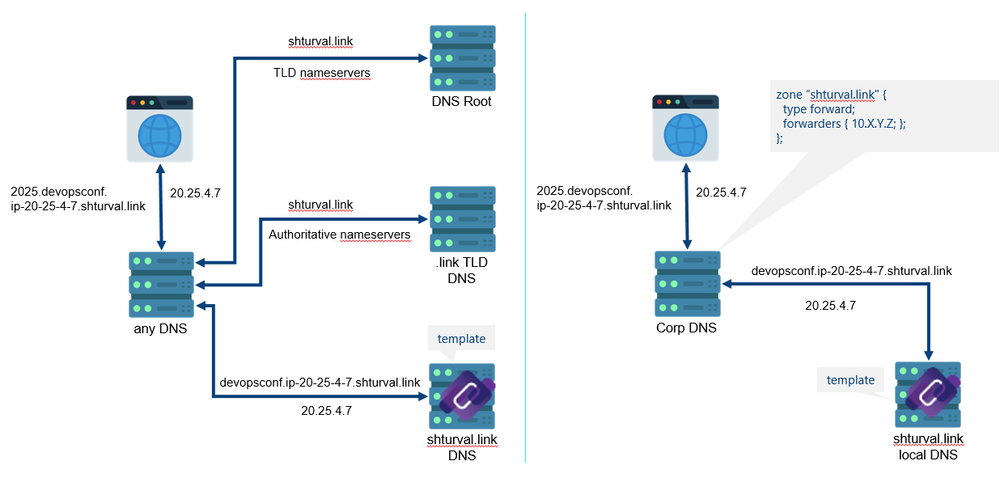

# Конфигурация no-ip зоны shturval.link

## Что делает

Резолвит адреса \*.\*.ip-a-b-c-d.shturval.link в ip a.b.c.d

```
dig 2025.devopsconf.ip-20-25-4-7.shturval.link @8.8.8.8

; <<>> DiG 9.16.1-Ubuntu <<>> 2025.devopsconf.ip-20-25-4-7.shturval.link @8.8.8.8
;; global options: +cmd
;; Got answer:
;; ->>HEADER<<- opcode: QUERY, status: NOERROR, id: 45138
;; flags: qr rd ra; QUERY: 1, ANSWER: 1, AUTHORITY: 0, ADDITIONAL: 1

;; OPT PSEUDOSECTION:
; EDNS: version: 0, flags:; udp: 512
;; QUESTION SECTION:
;2025.devopsconf.ip-20-25-4-7.shturval.link. IN A

;; ANSWER SECTION:
2025.devopsconf.ip-20-25-4-7.shturval.link. 3600 IN A 20.25.4.7

;; Query time: 109 msec
;; SERVER: 8.8.8.8#53(8.8.8.8)

```



## Как запустить
Скопировать или примонтировать файлы Corefile и shturval.link.zone в /etc/coredns/
```
./coredns 
```